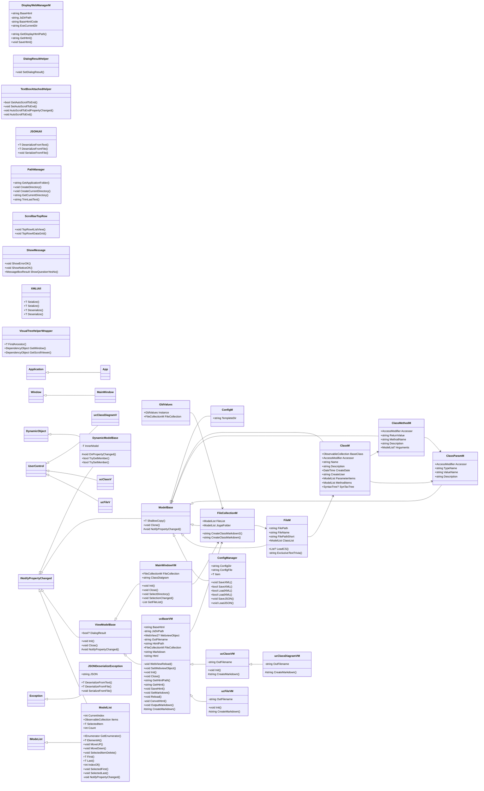

# クラス図

```mermaid
classDiagram
direction LR
	class App{
	}
	class MainWindow{
	}
	class GblValues{
		+GblValues Instance
		+FileCollectionM FileCollection
	}
	class ConfigM{
		+string TempleteDir
	}
	class DisplayWebManagerM{
		+string BaseHtml
		-string JsDirPath
		-string BaseHtmlCode
		+string ExeCurrentDir
		+string GetDisplayHtmlPath()
		+string GetHtml()
		+void SaveHtml()
	}
	class MainWindowVM{
		+FileCollectionM FileCollection
		+string ClassDialgram
		+void Init()
		+void Close()
		+void SelectDirectory()
		+void SelectionChanged()
		-List<string> GetFileList()
	}
	class DynamicModelBase{
		-T InnerModel
		#void OnPropertyChanged()
		+bool TryGetMember()
		+bool TrySetMember()
	}
	class ModelBase{
		+T ShallowCopy()
		+void Clone()
		#void NotifyPropertyChanged()
	}
	class ViewModelBase{
		+bool? DialogResult
		+void Init()
		+void Close()
		#void NotifyPropertyChanged()
	}
	class ClassM{
		+ObservableCollection<string> BaseClass
		+AccessModifier Accessor
		+string Name
		+string Description
		+DateTime CreateDate
		+string CreateUser
		+ModelList<ClassParamM> ParameterItems
		+ModelList<ClassMethodM> MethodItems
		+SyntaxTree? SynTaxTree
	}
	class ClassMethodM{
		+AccessModifier Accessor
		+string ReturnValue
		+string MethodName
		+string Description
		+ModelList<ClassParamM>? Arguments
	}
	class ClassParamM{
		+AccessModifier Accessor
		+string TypeName
		+string ValueName
		+string Description
	}
	class FileCollectionM{
		+ModelList<FileM> FileList
		+ModelList<string> JogaiFolder
		+string CreateClassMarkdown2()
		+string CreateClassMarkdown()
	}
	class FileM{
		+string FilePath
		+string FileName
		+string FilePathShort
		+ModelList<ClassM> ClassList
		+List<ClassM>? LoadCS()
		-string ExclusiveTextTrivia()
	}
	class ucBaseVM{
		+string BaseHtml
		-string JsDirPath
		+WebView2? WebviewObject
		-string OutFilename
		+string HtmlPath
		+FileCollectionM FileCollection
		+string Markdown
		+string Html
		-void WebViewReload()
		+void SetWebviewObject()
		+void Init()
		+void Close()
		+string GetHtmlPath()
		+string GetHtml()
		+void SaveHtml()
		+void SetMarkdown()
		+void Reload()
		-void ConvetHtml()
		+void OutputMarkdown()
		#string CreateMarkdown()
	}
	class ucClassDiagramVM{
		-string OutFilename
		#string CreateMarkdown()
	}
	class ucClassVM{
		-string OutFilename
		+void Init()
		#string CreateMarkdown()
	}
	class ucFileVM{
		-string OutFilename
		+void Init()
		#string CreateMarkdown()
	}
	class ucClassDiagramV{
	}
	class ucClassV{
	}
	class ucFileV{
	}
	class DialogResultHelper{
		+void SetDialogResult()
	}
	class TextBoxAttachedHelper{
		+bool GetAutoScrollToEnd()
		+void SetAutoScrollToEnd()
		-void AutoScrollToEndPropertyChanged()
		-void AutoScrollToEnd()
	}
	class ConfigManager{
		+string ConfigDir
		+string ConfigFile
		+T Item
		+void SaveXML()
		+bool SaveXML()
		+bool LoadXML()
		+bool LoadXML()
		+void SaveJSON()
		+void LoadJSON()
	}
	class JSONDeserializeException{
		+string JSON
		+T DeserializeFromText()
		+T DeserializeFromFile()
		+void SerializeFromFile()
	}
	class JSONUtil{
		+T DeserializeFromText()
		+T DeserializeFromFile()
		+void SerializeFromFile()
	}
	class ModelList{
		+int CurrentIndex
		+ObservableCollection<T> Items
		+T SelectedItem
		+int Count
		+IEnumerator<T> GetEnumerator()
		+T ElementAt()
		+void MoveUP()
		+void MoveDown()
		+void SelectedItemDelete()
		+T First()
		+T Last()
		+int IndexOf()
		+void SelectedFirst()
		+void SelectedLast()
		-void NotifyPropertyChanged()
	}
	class PathManager{
		+string GetApplicationFolder()
		+void CreateDirectory()
		+void CreateCurrentDirectory()
		+string GetCurrentDirectory()
		+string TrimLastText()
	}
	class ScrollbarTopRow{
		+void TopRow4ListView()
		+void TopRow4DataGrid()
	}
	class ShowMessage{
		+void ShowErrorOK()
		+void ShowNoticeOK()
		+MessageBoxResult ShowQuestionYesNo()
	}
	class XMLUtil{
		+T Seialize()
		+T Seialize()
		+T Deserialize()
		+T Deserialize()
	}
	class VisualTreeHelperWrapper{
		+T FindAncestor()
		+DependencyObject GetWindow()
		+DependencyObject GetScrollViewer()
	}
	GblValues --> FileCollectionM
	MainWindowVM --> FileCollectionM
	ClassM --> ClassMethodM
	ClassM --> ClassParamM
	ClassMethodM --> ClassParamM
	FileCollectionM --> FileM
	FileM --> ClassM
	ucBaseVM --> FileCollectionM
	Application<| -- App
	Window<| -- MainWindow
	ModelBase<| -- ConfigM
	ViewModelBase<| -- MainWindowVM
	DynamicObject<| -- DynamicModelBase
	INotifyPropertyChanged<| -- DynamicModelBase
	INotifyPropertyChanged<| -- ModelBase
	INotifyPropertyChanged<| -- ViewModelBase
	ModelBase<| -- ClassM
	ModelBase<| -- ClassMethodM
	ModelBase<| -- ClassParamM
	ModelBase<| -- FileCollectionM
	ModelBase<| -- FileM
	ViewModelBase<| -- ucBaseVM
	ucClassVM<| -- ucClassDiagramVM
	ucBaseVM<| -- ucClassVM
	ucBaseVM<| -- ucFileVM
	UserControl<| -- ucClassDiagramV
	UserControl<| -- ucClassV
	UserControl<| -- ucFileV
	ModelBase<| -- ConfigManager
	Exception<| -- JSONDeserializeException
	INotifyPropertyChanged<| -- ModelList
	IModeList<| -- ModelList
```
